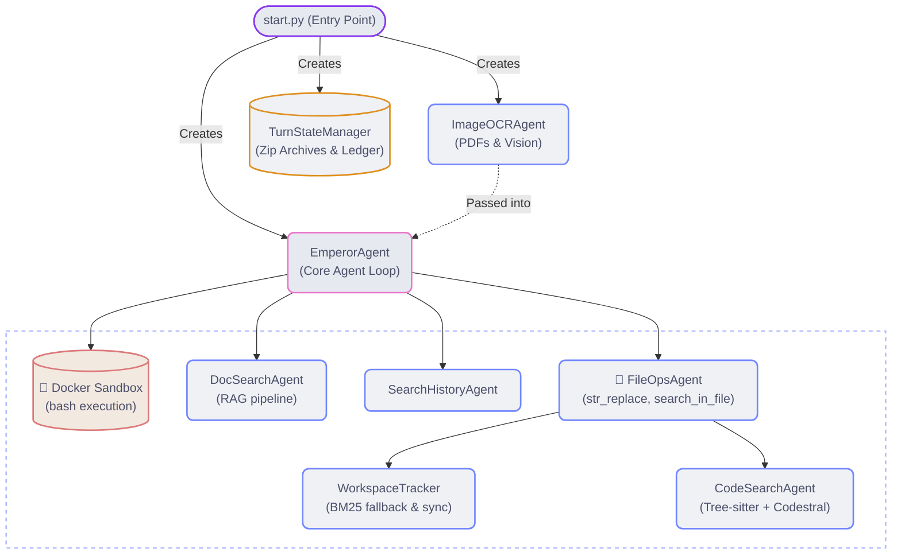

# Xtream - Sandboxed AI Assistant

Xtream is an agentic coding and research assistant that talks to multiple LLM
backends - NVIDIA NIM, Google Gemini, or
your own local llama.cpp server - through a plain XML tool-calling protocol,
so tool use works with any text-generating model, not just ones with native
function-calling support. Code execution runs inside an isolated Docker
sandbox. PDFs and plaintext files are ingested through a RAG pipeline
(chunking → embeddings → cosine similarity → reranking). Every turn is
zip-archived, so you can undo, rerun, or resume mid-task after an interrupt,
up to the last 20 turns, via `/restore N`.

## TL;DR

- **Semantic code search** - `workspace_search semantic=true` chunks code by
  function/class (tree-sitter) and embeds it, so a query like "where do we
  handle rate limiting" finds the right function even when those exact
  words never appear
- **Auto tool-format correction** - a local logistic-regression classifier
  catches it when a model hallucinates the wrong tool-call format and
  nudges it to retry, instead of dropping the turn
- **Academic & web search** - Linkup for live web results; Semantic Scholar
  for papers, with AI-generated TL;DRs and Open Access PDF links
- **Cross-session history** - every conversation is appended to a global,
  embeddings-searchable archive via `<search_history>`, independent of any
  single chat session
- **Image OCR & vision tiling** - dense scans/screenshots are automatically
  tiled so the model can read fine detail it would otherwise miss

---

## Architecture



`EmperorAgent` also owns `SearchHistoryAgent`, `ToolCallSummarizer`, and
`GlobalHistoryWriter` - see Operations & UI and State Management below.

## Features

### Core
- **Multi-Backend Support** - Switch between backends mid-session with
  `/cf`, `/nim`, `/google`, or `/local`.
- **NIM Send-Time XML-to-JSON Tool Mapping** - Translates inline XML tags into standard OpenAI/NIM `tool_calls` JSON schemas at send-time. This aligns with the native tool-calling format the models were trained on (preserving a coherent reasoning trajectory).
- **Gemini Thought Signature Serialization** - Captures the encrypted `thought_signature` from Google Gemini's streaming thought chunks. When the subsequent tool result is sent back, the agent injects this signature as a native thought part, allowing the Gemini API to restore its internal reasoning state.
- **Academic Literature Search** - Semantic Scholar results are reranked by relevance and support year filtering (`2022-`, `2020-2024`). Enabled via `/tool` → research.
- **Sandboxed Execution** - `/tool` opens a tool group selector (`web`, `files`, `pdf`, `bash`); Docker is required only if the `bash` group is enabled. The CLI itself always runs natively on the host.
- **File Storage** - Files are organized into three directories: `uploads/` for user-provided files, `scratch/` for the persistent working directory, and `outputs/` for generated shared artifacts.

### Intelligence & Search
- **Web Search** - Long pages are truncated by extracting main content and stripping navigation elements before they reach the model.
- **Search Reranking** - A cross-encoder model reranks both web search results and global history candidates before they reach the model.
- **Image OCR & Vision Tiling** - Images and PDFs are processed with parallel OCR (Gemini + NIM) for redundancy and speed.
- **PDF Ingestion** - Processes PDFs through the OCR pipeline, chunks the text, generates embeddings, and performs cosine similarity search via
  `doc_search`. Plaintext files (`.txt`, `.md`) skip the OCR step entirely -
  `ingest_text` chunks and embeds them directly so they're searchable the
  same way.
- **Workspace Search** - Two distinct modes, not a single feature with a
  toggle: by default, `semantic=false` runs a plain substring grep across
  both `scratch/` and `uploads/`. Setting `semantic=true` switches to
  Codestral Embed concept search - files are chunked by function/class
  (tree-sitter, with a regex fallback), embedded, and ranked by cosine
  similarity, so a query like "where do we handle rate limiting" finds the
  right function even when those exact words never appear. BM25 is kept as
  a silent fallback if the Mistral key is missing or the embed call fails.

### State Management
- **State Rollback** - Archives the scratch directory and workspace registry into a zip file at every successful turn; `/restore N` reverts the environment to any archived state.
- **History Editing** - `/edit N` modifies any previous message. Editing a **user** or
  **agent** message replaces the stored text. Run `/rerun N` afterward if you want to regenerate the response.
- **Turn Deletion** - `/delete N` removes turn N (user+assistant pair) from conversation
  memory and renumbers subsequent turns without changing the live workspace.
- **Execution Interruption** - Pressing `Ctrl+C` mid-turn pauses tool execution, rolls
  back any workspace changes made so far, and prompts first for an optional pasted
  thinking trace, then for guidance. Typing guidance resumes the turn from exactly
  where it was interrupted, with any pasted thinking trace injected alongside it so
  the model sees its own reasoning as well as your correction; pressing Enter on
  guidance cancels and saves a partial summary.
- **Global History Search** - Every turn is appended to a per-project JSONL file in a
  configurable global directory. The `<search_history>` tool indexes those turns with embeddings (incremental, sidecar-cached) and reranks the top candidates before
  returning them. This archive is permanent and cross-session - **`/reset` does not
  clear it.** `/reset` only wipes the current chat session, scratch files, and
  per-turn backups; the long-term history that `search_history` searches survives
  on purpose. `ingest_chat` lets you fold in transcripts pasted from other chat
  UIs (Gemini, ChatGPT web) - drop the raw text in `uploads/` and it's imported
  into this same archive, searchable via `search_history` from then on.
- **Workspace Synchronisation** - After every bash command, the agent calls
  `reconcile_workspace()` to detect filesystem changes and keep the BM25 index in sync
  with what is actually on disk.

### Operations & UI
- **String Replacement** - Exact-match, uniqueness-validated text replacement. Supports
  `count=N` to replace the first N occurrences, or `count=all` to rename a symbol
  everywhere in a file.
- **Tool Summarisation** - Compresses every tool call's outcome deterministically
  (no LLM needed) into a compact audit log, which is injected into the next turn's
  context so the model always knows what it did last.
- **Math Rendering** - Converts LaTeX math expressions to Unicode for clean terminal output.
- **Terminal UI** - Syntax-highlighted code blocks and Rich Markdown rendering via the
  Rich library.
- **Image Preview & `<show_image>`** - Renders images inline in the terminal via `chafa`. The `<show_image>` tool allows the model to display generated plots, diagrams, or images directly in the console.
- **Auto Image Enhancement & Preprocessing** - Automatically enhances image quality (contrast, orientation, brightness) on a copy before sending to OCR or vision models, without modifying the original file.

## Setup

### Prerequisites
- Python 3.11+
- Container runtime (e.g., Docker) - required only for tool mode (`/tool`)

### 1. Clone & Install

```bash
git clone https://github.com/emperorace00-creator/Xtream-Agentic-Harness.git
cd Xtream-Agentic-Harness
pip install -r requirements.txt
```

### 2. Configure API Keys

Copy the environment template:

```bash
cp .env.example .env
```

Edit `.env` - each variable points to a text file containing the raw key string:

```bash
GOOGLE_API_KEY_FILE=/path/to/google_api_key.txt
NVIDIA_API_KEY_FILE=/path/to/nvidia_api_key.txt
LINKUP_API_KEY_FILE=/path/to/linkup_api_key.txt
CLOUDFLARE_API_KEY_FILE=/path/to/cloudflare_api_key.txt
CLOUDFLARE_ACCOUNT_ID=your-cloudflare-account-id
SEMANTIC_SCHOLAR_API_KEY_FILE=/path/to/semantic_scholar_api_key.txt
MISTRAL_API_KEY_FILE=/path/to/mistral_api_key.txt  # Codestral Embed, semantic code search only

# Optional: shared history directory across projects.
# If unset, falls back to database/chat_histories/ inside this project folder.
GLOBAL_HISTORIES_DIR=/path/to/global/histories
```

**Required Services:**

| Service               | Function                                | URL                          |
| :-------------------- | :---------------------------------------| :----------------------------|
| NVIDIA NIM            | Default backend (Embeddings,OCR)        | build.nvidia.com             |
| Workers AI            | Cloudflare backend                      | dash.cloudflare.com          |
| Google AI             | Gemini backend                          | aistudio.google.com          |
| Linkup                | Web search                              | linkup.so                    |
| Mistral               | Codestral Embed (semantic code search)  | console.mistral.ai           |
| Local (llama.cpp)     | Self-hosted backend                     | github.com/ggml-org/llama.cpp|

Only NVIDIA is required for the full feature set (embeddings, reranking, OCR). Linkup is
needed for web search. Mistral is needed only for `workspace_search semantic=true`
(Codestral Embed); without it, that mode silently falls back to BM25. Each cloud LLM
backend is optional - the agent starts fine without any of them configured. Note that a
missing key isn't always surfaced up front: `WebAgent` and `ImageOCRAgent` print a
warning at startup if their key is missing, but a missing Google/NIM/Cloudflare key
currently fails silently until you actually try to use that backend, at which point
the API call errors out. Configure the key for whichever backend you plan to use as
your default before you start chatting with it.

### 3. Build the Sandbox (tool mode only)

```bash
docker build -t emperor-base:latest .
```

### 4. Run

```bash
python start.py
```

The sandbox container starts automatically when the `bash` group is enabled in `/tool`.

## Usage

### Chat
Enter messages directly into the terminal prompt.

### Commands

| Command               | Action                                                      |
| :-------------------- | :-----------------------------------------------------------|
| `/tool`               | Select tool groups (`web`, `files`, `pdf`, `bash`).         |
| `/google`             | Switch to Google Gemini backend                             |
| `/nim`                | Switch to NVIDIA NIM backend                                |
| `/cf`                 | Switch to Cloudflare backend (default)                      |
| `/local`              | Switch to a local llama.cpp server (see Local Backend below)|
| `/tools`              | Display current tool mode and active backend                |
| `/history`            | Print the current conversation history                      |
| `/turns`              | Display the turn timeline and revision markers              |
| `/review [focus]`     | Self-review the last response (optional focus text)         |
| `/rerun N` / `last`   | Regenerate the AI response for a specific turn              |
| `/edit N` / `last`    | Edit a past message                                         |
|                       | (see History Editing below for user vs. agent behavior)     |    
| `/restore N` / `last` | Revert workspace and memory to end of turn N                |
| `/delete N`           | Delete turn N (user+assistant pair) from conversation memory|
| `/reset`              | Clear the current session, scratch files, and backups       |
|                       | (Global History permanent chat storage still survives)      |

> **Tool groups**: `web` `files` `pdf` `bash` `research` - toggle any combination via `/tool`.

### Tool Mode

When `/tool` is active, the model can invoke tools using XML tags:

```xml
<!-- Run shell commands in the sandbox -->
<bash>python solution.py</bash>

<!-- Search the web (optional from_date="YYYY-MM-DD" attribute to restrict results) -->
<quick_search from_date="2024-01-01">Python asyncio gather vs wait</quick_search>

<!-- Read a URL -->
<url_search url="https://docs.python.org/3/" context="asyncio"/>

<!-- Replace string in a file -->
<str_replace>
<file>main.py</file>
<old_str>return None</old_str>
<new_str>return result</new_str>
</str_replace>

<!-- Rename a variable everywhere in a file -->
<str_replace>
<file>api/server.py</file>
<old_str>self._db_conn</old_str>
<new_str>self._connection</new_str>
<count>all</count>
</str_replace>

<!-- Read a section of a file -->
<view_lines>
<file>solution.py</file>
<start>1</start>
<end>50</end>
</view_lines>

<!-- Ingest a PDF for semantic search -->
<ingest_pdf>textbook.pdf</ingest_pdf>

<!-- Ingest a plaintext file for semantic search -->
<ingest_text>notes.txt</ingest_text>

<!-- Search ingested documents (PDFs and text files) using embeddings -->
<doc_search>
<query>Newton's second law derivation</query>
<top_k>5</top_k>
</doc_search>

<!-- Keyword search across scratch and uploads (exact grep, the default) -->
<workspace_search>
<query>API_KEY</query>
</workspace_search>

<!-- Semantic code search: concept-level, tree-sitter chunks + Codestral Embed -->
<workspace_search>
<query>where do we handle rate limit errors</query>
<semantic>true</semantic>
</workspace_search>

<!-- Search within a specific file -->
<search_in_file>
<file>utils.py</file>
<pattern>def parse_</pattern>
<context_lines>3</context_lines>
<regex>true</regex>
<max_results>10</max_results>
</search_in_file>

<!-- Search global conversation history -->
<search_history>
<query>kinetic theory gas pressure derivation</query>
<top_k>5</top_k>
</search_history>

<!-- Import a raw chat transcript pasted from another AI's web UI -->
<ingest_chat>gemini_chat.txt</ingest_chat>

<!-- Search the Semantic Scholar academic database -->
<search_semantic_scholar>
<query>self-supervised learning vision transformers</query>
<limit>5</limit>
<year>2021-</year>
</search_semantic_scholar>
```

### Local Backend

Run any model on your own machine via [llama.cpp](https://github.com/ggml-org/llama.cpp)'s
`llama-server` and connect to it with `/local`. Emperor is purely a client here - it
never launches or manages the server process. You start `llama-server.exe` yourself in
its own terminal, with whatever model, quant, and flags you want, and `/local` just
points at whatever's listening on the configured port. This keeps the workflow flexible
if you swap models/quants often - no code or config changes needed to try a different one.

**1. Start your local server** (example, adjust model/flags to your hardware):
```bash
llama-server.exe -m your-model.gguf --mmproj mmproj.gguf -c 6000 -fa on --port 1234 -np 1
```

**2. Set the endpoint** in `.env` if it's not the default:
```bash
LOCAL_BASE_URL=http://127.0.0.1:1234/v1
LOCAL_MODEL=your-model-name
LOCAL_API_KEY_FILE=   # leave blank unless you set --api-key on llama-server
```

**3. Switch to it** in-session:
```
/local
```

**Cache warm-up:** switching to `/local` (and toggling `/tool` while already on `/local`)
fires a background request that pushes the current system prompt into llama-server's KV
cache ahead of time, so your first real message only has to prefill the new content, not
the whole system prompt from scratch. This is a one-time-per-shape optimization - llama-server
keeps the growing conversation cached between turns on its own afterward (visible as
`graphs reused` in the server log), nothing further needed from Emperor's side.

**Reasoning / thinking control:** on models with a Gemma-4-style thinking mode, this is
controlled entirely by the flag you launch `llama-server` with, not from inside Emperor:
- Thinking **on** (default for most reasoning-capable models) - no flag needed.
- Thinking **off** - add `--reasoning off` to your launch command.

To switch modes, close the running `llama-server.exe` and relaunch with the flag added or
removed, then run `/local` again in Emperor to reconnect and re-warm the cache.

## Project Structure

```text
Xtream/
├── start.py                  # Entry point: Docker setup, CLI loop, command dispatch
├── config.py                 # Configuration, paths, model names, env vars
├── emperor_agent.py          # Core agent: generation loop, XML tool parser, history
├── llm_backends.py           # API integrations for NIM, Gemini, Cloudflare (mixin)
├── tool_handlers.py          # Tool dispatch and handler methods (mixin)
├── core_tool_definitions.py  # System prompt blocks for all XML tools
├── renderer.py               # Terminal rendering: LaTeX → Unicode, syntax highlight
├── web_agent.py              # Linkup search, URL fetch, content extraction, reranker
├── file_ops_agent.py         # str_replace, view_lines, search_in_file, workspace search
├── workspace_tracker.py      # File registry, BM25 index, reconcile
├── code_search_agent.py      # Tree-sitter chunking, Codestral Embed, semantic code search
├── doc_search_agent.py       # PDF chunking, NVIDIA embeddings, cosine similarity
├── image_ocr_agent.py        # 3-tier NIM OCR fallback chain (parallel threads)
├── turn_state_manager.py     # Per-turn zip archives, turn ledger, /restore pipeline
├── tool_summarizer.py        # Deterministic tool-call log compressor
├── utils.py                  # Token counter, GlobalHistoryWriter, image preprocessor
├── Dockerfile                # Sandbox container image
├── entrypoint.sh             # Container initialisation script
├── requirements.txt          # Python package dependencies
├── .env.example               # Environment variable template
└── .gitignore                # Excludes secrets and runtime data
```

## Design Decisions

- **Incremental, Lazy Re-embedding for Code Search**: Re-indexing on every
  edit would make every `bash` or `str_replace` call latency-bound by
  embedding calls. Instead, edits only flip a stale flag; re-embedding
  happens lazily on the next semantic query, and only for files whose MD5
  actually changed. PDF and global-history embeddings are unaffected - they
  still run through the existing NVIDIA Nemotron `_embed()` path, since
  Codestral Embed is used for code only.

- **Zip Archives for State Management**: Per-turn state is stored as a zip of the
  scratch directory plus a registry snapshot, rather than a git history. This avoids
  merge conflicts and keeps the rollback path simple: unzip, reload, truncate history.
  Only the last 20 archives are kept; ledger entries (turn metadata) are kept forever.

- **Host CLI, Containerised Bash**: `start.py` runs natively on the host so readline,
  arrow keys, and Rich formatting work without TTY emulation. Only `<bash>` tool
  commands are proxied through `docker exec`, giving full shell access inside an
  isolated container without affecting the terminal experience.

- **Deterministic Tool Summarisation**: Storing full tool use history will add context bloat to every subsequent turn. Since tool calls are structured data, a plain string-inspection pass (see Tool Summarisation above) is both
  cheap & accurate to the ground truth.

## License

MIT - see [LICENSE](LICENSE) for details.